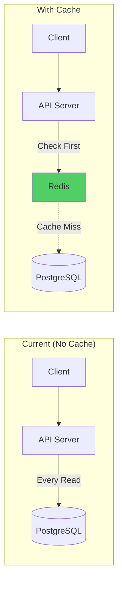
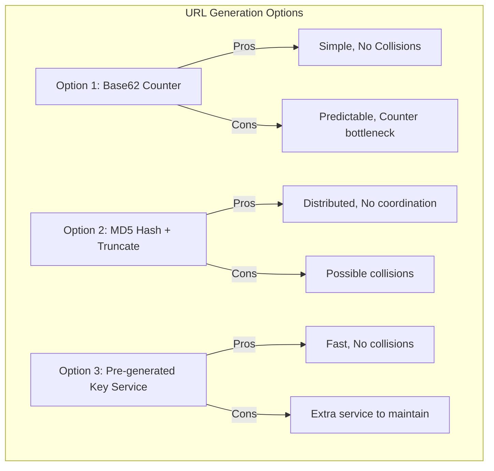

# 🏗️ System Design Practice Module — Complete Blueprint

> **Route:** `/mock/practice/sd/[problemSlug]`  
> **Workspace Type:** Excalidraw Whiteboard + Component Library + AI Chat  
> **Purpose:** Interactive system design practice with AI architecture review

---

## Table of Contents

1. [Why System Design Needs a Different Workspace](#1-why-system-design-needs-a-different-workspace)
2. [Screen Layout & Wireframe](#2-screen-layout--wireframe)
3. [Requirements Panel (Left)](#3-requirements-panel-left)
4. [Whiteboard Panel (Center) — Excalidraw](#4-whiteboard-panel-center--excalidraw)
5. [Component Library — Drag & Drop Architecture Blocks](#5-component-library--drag--drop-architecture-blocks)
6. [AI Reviewer Panel (Right)](#6-ai-reviewer-panel-right)
7. [The "Assess" Flow — Canvas to AI Pipeline](#7-the-assess-flow--canvas-to-ai-pipeline)
8. [Assist Mode for System Design](#8-assist-mode-for-system-design)
9. [AI Prompt Engineering for System Design](#9-ai-prompt-engineering-for-system-design)
10. [Evaluation Rubric](#10-evaluation-rubric)
11. [Voice Interaction for System Design](#11-voice-interaction-for-system-design)
12. [Problem Structure & Categories](#12-problem-structure--categories)
13. [User Flow Diagrams](#13-user-flow-diagrams)
14. [Example Walkthrough: URL Shortener](#14-example-walkthrough-url-shortener)

---

## 1. Why System Design Needs a Different Workspace

System Design is fundamentally different from DSA:

| Aspect | DSA | System Design |
|--------|-----|---------------|
| **Input** | Code in text editor | Diagrams on canvas |
| **Output** | Correct algorithm | Scalable architecture |
| **Evaluation** | Right/Wrong + Complexity | Rubric-based scoring |
| **Visualization** | AI generates flowcharts | User draws architecture |
| **Ambiguity** | Low (clear test cases) | High (many valid designs) |
| **AI Analysis** | Read code text | Parse canvas elements |
| **Key Skill** | Algorithm knowledge | Trade-off reasoning |

This is why we need **Excalidraw** as the center workspace instead of a code editor.

---

## 2. Screen Layout & Wireframe

```
┌─────────────────────────────────────────────────────────────────────────────┐
│  ◀ Practice    SD › Design a URL Shortener              🔊 OFF  ⏱ 25:00  │
├──────────┬────────────────────────────────┬──────────────────────────────────┤
│          │                                │                                  │
│ REQUIRE- │     EXCALIDRAW WHITEBOARD      │     AI ARCHITECTURE REVIEWER     │
│ MENTS    │                                │                                  │
│          │  ┌──────────────────────────┐  │  ┌────────────────────────────┐  │
│ Func-    │  │                          │  │  │ 🤖 Design a URL shortener │  │
│ tional:  │  │  [Client]                │  │  │ like bit.ly. Start by     │  │
│          │  │     │                     │  │  │ clarifying requirements   │  │
│ • Short  │  │     ▼                     │  │  │ and estimating scale.     │  │
│   URLs   │  │  [API Server] ──▶ [DB]   │  │  │                            │  │
│ • Redir  │  │                          │  │  │ Hit "Assess" when ready   │  │
│ • Custom │  │                          │  │  │ for feedback!              │  │
│   alias  │  │                          │  │  └────────────────────────────┘  │
│ • Expiry │  │                          │  │                                  │
│ • Stats  │  │                          │  │  ── Component Library ────────  │
│          │  └──────────────────────────┘  │  ┌────────────────────────────┐  │
│ Non-     │                                │  │ 🗄 Databases:              │  │
│ Func:    │  Components:                   │  │   PostgreSQL  MongoDB      │  │
│          │  [DB] [Cache] [LB] [Queue]     │  │   Redis       DynamoDB    │  │
│ • 100M   │  [CDN] [API] [Client]          │  │                            │  │
│   URLs/  │                                │  │ ⚖ Load Balancers:         │  │
│   day    │  ┌──────────────────────────┐  │  │   Nginx  HAProxy  ALB     │  │
│ • Low    │  │ [🔍 Assess Architecture] │  │  │                            │  │
│   latency│  │ [💡 Hint] [📊 Scoring]  │  │  │ 📨 Queues:                │  │
│ • 99.99% │  └──────────────────────────┘  │  │   Kafka  RabbitMQ  SQS    │  │
│   uptime │                                │  │                            │  │
│          │                                │  │ 🌐 CDNs:                  │  │
│ Scale    │                                │  │   CloudFront  Cloudflare  │  │
│ ──────   │                                │  │                            │  │
│ • 1B     │                                │  │ 💾 Caches:                │  │
│   short  │                                │  │   Redis  Memcached        │  │
│   URLs   │                                │  └────────────────────────────┘  │
│ • Read/  │                                │                                  │
│   Write: │                                │  ┌────────────────────────────┐  │
│   100:1  │                                │  │ 💬 Type or speak...       │  │
│          │                                │  │              [Send] [🎤]  │  │
│ Est.     │                                │  └────────────────────────────┘  │
│ ──────   │                                │                                  │
│ QPS:     │                                │                                  │
│ 11.5K    │                                │                                  │
│ reads    │                                │                                  │
│          │                                │                                  │
├──────────┴────────────────────────────────┴──────────────────────────────────┤
│  Score: —/10  │  Components: 3  │  Connections: 2  │  Missing: Cache, LB    │
└─────────────────────────────────────────────────────────────────────────────┘
```

---

## 3. Requirements Panel (Left)

### Content Structure

```typescript
interface SystemDesignProblem {
  id: string;
  slug: string;
  title: string;                         // "Design a URL Shortener"
  difficulty: "Easy" | "Medium" | "Hard";
  
  // Requirements (shown to user)
  functionalRequirements: string[];      // ["Generate short URLs", "Redirect to original"]
  nonFunctionalRequirements: string[];   // ["Low latency < 200ms", "99.99% availability"]
  
  // Scale Estimation
  scaleEstimation: {
    users: string;                       // "100M registered users"
    dailyActiveUsers: string;            // "10M DAU"
    readsPerDay: string;                 // "1B reads/day"
    writesPerDay: string;                // "10M writes/day"
    storageEstimate: string;             // "100TB over 5 years"
    bandwidthEstimate: string;           // "500 MB/s reads"
  };
  
  // Capacity Estimation Scratchpad (editable by user)
  estimationTemplate: string;            // Pre-filled calculation template
  
  // Expected Components in Solution
  expectedComponents: {
    required: string[];                  // ["Load Balancer", "Application Server", "Database"]
    recommended: string[];               // ["Cache", "CDN", "Rate Limiter"]
    advanced: string[];                  // ["Bloom Filter", "Consistent Hashing"]
  };
  
  // AI Context
  keyDesignDecisions: string[];          // ["SQL vs NoSQL", "Hash function choice"]
  commonMistakes: string[];              // ["No caching layer", "Single point of failure"]
  tradeoffs: {
    decision: string;
    option1: { name: string; pros: string[]; cons: string[] };
    option2: { name: string; pros: string[]; cons: string[] };
  }[];
  
  // Reference Architecture (for AI evaluation)
  referenceArchitecture: {
    components: string[];
    connections: { from: string; to: string; label?: string }[];
    explanation: string;
  };
}
```

### Requirements Panel Layout

```
┌──────────────────────────────┐
│ Requirements Panel           │
│                              │
│ Tabs:                        │
│ [Requirements] [Scale] [📝] │
│                              │
│ ── Requirements Tab ──       │
│                              │
│ Functional:                  │
│ ☐ Generate short URL         │
│ ☐ Redirect to original       │
│ ☐ Custom alias support       │
│ ☐ URL expiration             │
│ ☐ Analytics/click tracking   │
│                              │
│ Non-Functional:              │
│ • Low latency (< 200ms)     │
│ • High availability (99.99%)│
│ • URLs should not be         │
│   predictable                │
│ • Read-heavy system          │
│                              │
│ ── Scale Tab ──              │
│                              │
│ • 100M URLs created/month   │
│ • Read:Write = 100:1         │
│ • URL size: ~100 bytes       │
│ • Short URL length: 7 chars │
│ • 5 year storage             │
│                              │
│ QPS Estimation:              │
│ Write: 100M/30/24/3600 ≈ 40 │
│ Read: 40 × 100 = 4,000      │
│ Peak: 4,000 × 3 = 12,000    │
│                              │
│ Storage:                     │
│ 100M × 12 × 5 × 100B = 6TB │
│                              │
│ ── Scratchpad Tab (📝) ──   │
│                              │
│ [User can type calculations] │
│                              │
└──────────────────────────────┘
```

---

## 4. Whiteboard Panel (Center) — Excalidraw

### Excalidraw Integration

We embed `@excalidraw/excalidraw` as a React component:

```typescript
interface WhiteboardConfig {
  // Excalidraw settings
  theme: "light" | "dark";              // Match app theme
  gridMode: true;                        // Show grid for alignment
  
  // Custom library (architecture components)
  libraryItems: ExcalidrawLibraryItem[];
  
  // Toolbar customization
  showToolbar: true;
  customTools: ["component-library"];    // Add our component palette
  
  // Canvas state
  onCanvasChange: (elements: ExcalidrawElement[]) => void;
  initialElements?: ExcalidrawElement[];  // Restore previous session
  
  // Export for AI analysis
  exportCanvas: () => ExcalidrawElement[];
  exportAsImage: () => Promise<Blob>;     // Fallback for vision AI
}
```

### Component Toolbar (Below Canvas)

```
┌────────────────────────────────────────────────────────────────┐
│ Quick Components:                                              │
│                                                                │
│ [👤 Client] [⚖ Load Balancer] [🖥 API Server] [🗄 Database] │
│ [💾 Cache] [📨 Queue] [🌐 CDN] [📦 Storage] [🔒 Auth]      │
│                                                                │
│ Click to add to canvas. Drag to position. Connect with arrows.│
└────────────────────────────────────────────────────────────────┘
```

Each component comes as a pre-styled Excalidraw group:

```
┌──────────┐
│ 🗄       │
│ Database │
│ (SQL)    │
└──────────┘
```

The user can click it, and it appears on the canvas. They label it (e.g., "PostgreSQL - Users") and draw arrows between components.

---

## 5. Component Library — Drag & Drop Architecture Blocks

### Complete Component Categories

```
┌──────────────────────────────────────────────────────────────────┐
│                    COMPONENT LIBRARY                              │
│                                                                  │
│  ── Clients ──                                                   │
│  [👤 Web Client] [📱 Mobile Client] [🤖 API Client]            │
│                                                                  │
│  ── Networking ──                                                │
│  [🌐 DNS] [🔀 Load Balancer] [🛡 API Gateway]                  │
│  [🔒 WAF] [📡 CDN]                                             │
│                                                                  │
│  ── Compute ──                                                   │
│  [🖥 Application Server] [⚡ Serverless Function]               │
│  [🐳 Container] [👷 Worker Service]                             │
│                                                                  │
│  ── Databases ──                                                 │
│  [🗄 SQL Database] [📦 NoSQL Database]                          │
│  [📊 Column Store] [🔍 Search Engine]                           │
│  [📈 Time Series DB] [🕸 Graph Database]                        │
│                                                                  │
│  ── Caching ──                                                   │
│  [💾 Redis Cache] [💾 Memcached] [💾 CDN Cache]                │
│  [💾 Browser Cache]                                              │
│                                                                  │
│  ── Messaging ──                                                 │
│  [📨 Message Queue] [📢 Pub/Sub] [📡 Event Bus]                │
│  [🔔 Notification Service]                                      │
│                                                                  │
│  ── Storage ──                                                   │
│  [📁 Object Storage (S3)] [💿 Block Storage]                    │
│  [📂 File System]                                                │
│                                                                  │
│  ── Monitoring ──                                                │
│  [📊 Metrics] [📝 Logging] [🔍 Tracing]                        │
│  [⚠ Alerting]                                                   │
│                                                                  │
│  ── Security ──                                                  │
│  [🔐 Auth Service] [🔑 Token Service]                           │
│  [🛡 Rate Limiter] [🔒 Encryption]                              │
│                                                                  │
│  Each component is a styled Excalidraw group with:              │
│  • Icon                                                          │
│  • Label (editable)                                              │
│  • Color coding by category                                      │
│  • Connectable endpoints                                         │
│                                                                  │
└──────────────────────────────────────────────────────────────────┘
```

---

## 6. AI Reviewer Panel (Right)

### Chat Flow for System Design

```
┌──────────────────────────────────────┐
│ 🤖 AI Architecture Reviewer    [⚙]  │
│                                      │
│ ┌──────────────────────────────────┐ │
│ │ Mode: [🎯 Exam] [🤝 Assist]    │ │
│ └──────────────────────────────────┘ │
│                                      │
│ ╔══════════════════════════════════╗ │
│ ║ 🤖 Welcome! You're designing a  ║ │
│ ║ **URL Shortener** like bit.ly.   ║ │
│ ║                                  ║ │
│ ║ **Steps to follow:**             ║ │
│ ║ 1. Clarify requirements ✅       ║ │
│ ║ 2. Estimate scale                ║ │
│ ║ 3. Design high-level arch.       ║ │
│ ║ 4. Deep dive into components     ║ │
│ ║ 5. Handle bottlenecks            ║ │
│ ║                                  ║ │
│ ║ Start drawing your architecture  ║ │
│ ║ on the whiteboard and click      ║ │
│ ║ **"Assess"** when you want       ║ │
│ ║ feedback!                        ║ │
│ ╚══════════════════════════════════╝ │
│                                      │
│ ── After "Assess" ──                │
│                                      │
│ ╔══════════════════════════════════╗ │
│ ║ 🤖 **Architecture Review:**     ║ │
│ ║                                  ║ │
│ ║ **Score: 4/10** ⬆ Room to grow  ║ │
│ ║                                  ║ │
│ ║ **What's good:**                 ║ │
│ ║ ✅ Basic client → server → DB    ║ │
│ ║ ✅ Database choice identified    ║ │
│ ║                                  ║ │
│ ║ **What's missing:**              ║ │
│ ║ ⚠ No Load Balancer (SPOF!)      ║ │
│ ║ ⚠ No Caching (100:1 read/write) ║ │
│ ║ ⚠ No URL generation strategy    ║ │
│ ║                                  ║ │
│ ║ **Rubric Breakdown:**            ║ │
│ ║                                  ║ │
│ ║ ```mermaid                       ║ │
│ ║ pie title Design Score           ║ │
│ ║   "Scalability" : 2             ║ │
│ ║   "Reliability" : 1             ║ │
│ ║   "Data Flow" : 3               ║ │
│ ║   "Component Choice" : 3        ║ │
│ ║   "Missing" : 6                 ║ │
│ ║ ```                              ║ │
│ ║                                  ║ │
│ ║ 💭 **Question:** Your API       ║ │
│ ║ server handles all 12,000 QPS   ║ │
│ ║ at peak. What happens when it   ║ │
│ ║ crashes? How do users reach     ║ │
│ ║ your service?                    ║ │
│ ╚══════════════════════════════════╝ │
│                                      │
│ ┌──────────────────────────────────┐ │
│ │ 💬 Type or speak...      [🎤]   │ │
│ │                          [Send]  │ │
│ └──────────────────────────────────┘ │
│                                      │
└──────────────────────────────────────┘
```

---

## 7. The "Assess" Flow — Canvas to AI Pipeline

### The Core Technical Challenge

The AI can't "see" an Excalidraw canvas directly. We need to convert the canvas into a format the AI can understand.

### Two Strategies (We Use Both)

```
┌──────────────────────────────────────────────────────────────────┐
│           CANVAS → AI ANALYSIS PIPELINE                          │
│                                                                  │
│  Strategy A: Structural Analysis (Primary — Fast, Cheap)        │
│  ────────────────────────────────────────────────────            │
│                                                                  │
│  ┌──────────────┐    ┌─────────────────┐    ┌──────────────┐    │
│  │  Excalidraw  │    │  Extract        │    │  Generate    │    │
│  │  Canvas      │───▶│  Elements       │───▶│  Text        │    │
│  │  (JSON)      │    │                 │    │  Topology    │    │
│  └──────────────┘    │  • Text nodes   │    │              │    │
│                      │  • Rectangles   │    │  "Client     │    │
│                      │  • Arrows       │    │   connects   │    │
│                      │  • Groups       │    │   to LB      │    │
│                      │  • Library IDs  │    │   which      │    │
│                      └─────────────────┘    │   connects   │    │
│                                             │   to API..."  │    │
│                                             └──────┬───────┘    │
│                                                    │             │
│                                                    ▼             │
│                                             ┌──────────────┐    │
│                                             │  Send to     │    │
│                                             │  GPT-4o      │    │
│                                             │  (text only) │    │
│                                             └──────────────┘    │
│                                                                  │
│  Strategy B: Vision Analysis (Fallback — Better, Expensive)     │
│  ────────────────────────────────────────────────────            │
│                                                                  │
│  ┌──────────────┐    ┌─────────────────┐    ┌──────────────┐    │
│  │  Excalidraw  │    │  Export as      │    │  Send to     │    │
│  │  Canvas      │───▶│  PNG/JPEG       │───▶│  GPT-4o      │    │
│  │              │    │  (base64)       │    │  (vision)    │    │
│  └──────────────┘    └─────────────────┘    └──────────────┘    │
│                                                                  │
│  We prefer Strategy A because:                                   │
│  • 10x cheaper (no vision tokens)                               │
│  • Faster response                                               │
│  • More precise (components are labeled)                        │
│  • Easier to reference specific components                      │
│                                                                  │
│  We fall back to Strategy B when:                                │
│  • User draws freehand (no library components)                  │
│  • Canvas has complex visual relationships                      │
│  • User explicitly requests visual review                       │
│                                                                  │
└──────────────────────────────────────────────────────────────────┘
```

### Structural Extraction Algorithm

```typescript
interface CanvasTopology {
  components: {
    id: string;
    type: string;                        // "database", "load_balancer", "api_server"
    label: string;                       // "PostgreSQL - Users"
    position: { x: number; y: number };
    category: string;                    // "storage", "compute", "networking"
  }[];
  
  connections: {
    from: string;                        // Component ID
    to: string;                          // Component ID
    label?: string;                      // "REST API", "gRPC", "WebSocket"
    direction: "one-way" | "two-way";
  }[];
  
  annotations: {
    text: string;                        // User's notes on canvas
    position: { x: number; y: number };
  }[];
  
  // Derived analysis
  missingComponents: string[];           // Based on problem requirements
  singlePointsOfFailure: string[];       // Components with no redundancy
  dataFlowIssues: string[];              // Disconnected components, cycles
}

function extractTopology(elements: ExcalidrawElement[]): CanvasTopology {
  // 1. Find all rectangles/groups → components
  // 2. Find all arrows → connections
  // 3. Find all text nodes → labels/annotations
  // 4. Match arrows to connected components (by endpoint proximity)
  // 5. Identify library items by metadata
  // 6. Analyze for SPOF, missing components, etc.
  return topology;
}
```

### Topology Text Format Sent to AI

```json
{
  "problem": "URL Shortener",
  "userArchitecture": {
    "components": [
      { "type": "client", "label": "Web Client" },
      { "type": "api_server", "label": "Node.js API" },
      { "type": "sql_database", "label": "PostgreSQL" }
    ],
    "connections": [
      { "from": "Web Client", "to": "Node.js API", "label": "HTTPS" },
      { "from": "Node.js API", "to": "PostgreSQL", "label": "SQL Queries" }
    ],
    "missingComponents": ["Load Balancer", "Cache", "CDN"],
    "singlePointsOfFailure": ["Node.js API", "PostgreSQL"]
  },
  "requirements": {
    "qps": "12,000 read QPS at peak",
    "availability": "99.99%",
    "readWriteRatio": "100:1"
  },
  "assessmentNumber": 1,
  "previousFeedback": []
}
```

---

## 8. Assist Mode for System Design

### How Assist Mode Works Differently

In Assist Mode, the AI proactively helps the user build the architecture:

```
┌──────────────────────────────────────────────────────────────────┐
│           ASSIST MODE — STEP-BY-STEP GUIDANCE                    │
│                                                                  │
│  Step 1: Requirements Clarification                             │
│  ┌──────────────────────────────────────────────────────────┐   │
│  │ 🤝 "Let's start by clarifying what this system needs     │   │
│  │ to do. I'll list the functional requirements on the      │   │
│  │ left panel. Check them off as we discuss each one."       │   │
│  └──────────────────────────────────────────────────────────┘   │
│                                                                  │
│  Step 2: Scale Estimation                                       │
│  ┌──────────────────────────────────────────────────────────┐   │
│  │ 🤝 "Good! Now let's estimate scale. With 100M URLs/     │   │
│  │ month and a 100:1 read/write ratio, here's the math:    │   │
│  │                                                          │   │
│  │ Write QPS = 100M / (30 × 24 × 3600) ≈ 40 QPS           │   │
│  │ Read QPS = 40 × 100 = 4,000 QPS                         │   │
│  │ Peak Read = 4,000 × 3 = 12,000 QPS                      │   │
│  │                                                          │   │
│  │ This tells us we need a read-heavy architecture.         │   │
│  │ What component helps with read-heavy workloads?"         │   │
│  └──────────────────────────────────────────────────────────┘   │
│                                                                  │
│  Step 3: High-Level Design                                      │
│  ┌──────────────────────────────────────────────────────────┐   │
│  │ 🤝 "Start with the basics. Place these on your canvas:  │   │
│  │                                                          │   │
│  │ ```mermaid                                               │   │
│  │ graph LR                                                 │   │
│  │   C[Client] --> LB[Load Balancer]                        │   │
│  │   LB --> API[API Servers]                                │   │
│  │   API --> Cache[Redis Cache]                             │   │
│  │   API --> DB[(Database)]                                 │   │
│  │   Cache -.-> DB                                          │   │
│  │ ```                                                      │   │
│  │                                                          │   │
│  │ Use the component library on the right to drag and drop  │   │
│  │ these components. Then draw arrows between them."         │   │
│  └──────────────────────────────────────────────────────────┘   │
│                                                                  │
│  Step 4: Deep Dive                                              │
│  ┌──────────────────────────────────────────────────────────┐   │
│  │ 🤝 "Great architecture! Now let's think about:           │   │
│  │                                                          │   │
│  │ 1. **URL Generation:** How will you create short URLs?   │   │
│  │    Options: Base62 encoding, MD5 hash + truncate,        │   │
│  │    pre-generated key service                              │   │
│  │                                                          │   │
│  │ 2. **Database Choice:** With billions of simple records, │   │
│  │    would you use SQL or NoSQL? Think about the access    │   │
│  │    patterns."                                             │   │
│  └──────────────────────────────────────────────────────────┘   │
│                                                                  │
│  Step 5: Bottleneck Analysis                                    │
│  ┌──────────────────────────────────────────────────────────┐   │
│  │ 🤝 "Your design handles the happy path well. Now let's   │   │
│  │ stress test it:                                           │   │
│  │                                                          │   │
│  │ ⚡ What happens at 12K QPS peak?                         │   │
│  │ 💥 What if your database goes down?                      │   │
│  │ 🌍 What about users in different continents?             │   │
│  │                                                          │   │
│  │ Consider adding: Database replicas, CDN, and             │   │
│  │ multi-region deployment."                                 │   │
│  └──────────────────────────────────────────────────────────┘   │
│                                                                  │
└──────────────────────────────────────────────────────────────────┘
```

---

## 9. AI Prompt Engineering for System Design

### System Prompt Template

```markdown
You are a Principal Engineer reviewing a system design on CoderzHQ Practice. 

## Your Personality:
- Think of yourself as a senior architect at a FAANG company
- Be constructive, never dismissive
- Ask probing questions about trade-offs
- Use the Socratic method for Exam mode
- Be direct and educational for Assist mode

## Rules:
1. NEVER give the complete architecture at once
2. Evaluate the design based on the rubric (Scalability, Reliability, Data Flow, Component Choice)
3. Identify Single Points of Failure (SPOFs)
4. Point out missing components relevant to the requirements
5. Generate mermaid diagrams showing:
   - Suggested improvements
   - Data flow patterns
   - Read/Write paths
6. Ask about trade-offs the user hasn't considered
7. Reference specific components from the user's canvas
8. Score the design from 0-10 with rubric breakdown

## For ASSIST MODE:
- Walk through the design step-by-step
- Suggest specific components from the library
- Show reference architecture progressively
- Explain WHY each component is needed

## Scoring Rubric:
- Scalability (0-10): Can it handle the estimated load?
- Reliability (0-10): What's the failure tolerance?
- Data Flow (0-10): Are read/write paths efficient?
- Component Choice (0-10): Are the right tools used?
- Overall (0-10): Average of above

## Output Format:
1. **Score:** X/10 with rubric breakdown
2. **What's Good:** Acknowledge correct design decisions
3. **Issues Found:** List with severity (🔴 Critical, 🟡 Important, 🟢 Nice-to-have)
4. **Visual Suggestion:** Mermaid diagram of improvement
5. **Guiding Question:** One question to push the design forward
```

---

## 10. Evaluation Rubric

### Scoring Visualization

```
┌──────────────────────────────────────────────────────────────────┐
│           SYSTEM DESIGN SCORING RUBRIC                           │
│                                                                  │
│  ┌──────────────────────────────────────────────────────────┐   │
│  │                                                          │   │
│  │  Scalability        ████████░░  8/10                     │   │
│  │  Can handle 12K QPS with LB + caching                   │   │
│  │                                                          │   │
│  │  Reliability         ██████░░░░  6/10                    │   │
│  │  DB has no replica, single region deployment            │   │
│  │                                                          │   │
│  │  Data Flow           █████████░  9/10                    │   │
│  │  Clean read/write separation, cache-aside pattern       │   │
│  │                                                          │   │
│  │  Component Choice    ████████░░  8/10                    │   │
│  │  Good use of Redis, but consider NoSQL over SQL         │   │
│  │                                                          │   │
│  │  ─────────────────────────────────────                   │   │
│  │  Overall Score:      ████████░░  7.75/10                 │   │
│  │                                                          │   │
│  └──────────────────────────────────────────────────────────┘   │
│                                                                  │
│  ```mermaid                                                      │
│  radar                                                           │
│    title Design Score                                            │
│    "Scalability": 8                                              │
│    "Reliability": 6                                              │
│    "Data Flow": 9                                                │
│    "Components": 8                                               │
│  ```                                                             │
│                                                                  │
│  Improvements to reach 10/10:                                    │
│  🟡 Add database read replicas (+1 Reliability)                 │
│  🟡 Consider multi-region deployment (+1 Reliability)            │
│  🟢 Add monitoring/alerting (+0.5 Reliability)                   │
│  🟢 Evaluate DynamoDB for key-value workload (+0.5 Components)  │
│                                                                  │
└──────────────────────────────────────────────────────────────────┘
```

---

## 11. Voice Interaction for System Design

### SD-Specific Voice Scenarios

```
┌──────────────────────────────────────────────────────────────────┐
│           VOICE INTERACTION FOR SYSTEM DESIGN                    │
│                                                                  │
│  Scenario 1: Discussing trade-offs                              │
│  ──────────────────────────────────                             │
│  🎤 User: "Should I use SQL or NoSQL for the URL mappings?"    │
│                                                                  │
│  🔊 AI:   "Great question! Think about your access pattern.     │
│            You're doing simple key-value lookups — short URL     │
│            to long URL. SQL would work, but NoSQL databases     │
│            like DynamoDB are optimized for exactly this pattern. │
│            They also scale horizontally more easily. What do    │
│            you think?"                                           │
│                                                                  │
│  Scenario 2: Defending a design decision                        │
│  ──────────────────────────────────                             │
│  🎤 User: "I put the cache before the database because most    │
│            requests are reads, so we check cache first."        │
│                                                                  │
│  🔊 AI:   "That's called the Cache-Aside pattern, and it's    │
│            perfect for read-heavy workloads like yours.         │
│            Your cache hit ratio will be high because popular    │
│            URLs get accessed repeatedly. Well done!             │
│            Now, what happens on a cache miss?"                  │
│                                                                  │
│  Scenario 3: Asking for help (Assist Mode)                     │
│  ──────────────────────────────────                             │
│  🎤 User: "I'm not sure where to put the rate limiter."        │
│                                                                  │
│  🔊 AI:   "Rate limiters typically go right after the load     │
│            balancer and before your API servers. This way,      │
│            you can reject excessive requests before they        │
│            consume server resources. Look at the Networking     │
│            section in your component library — you'll find it   │
│            there."                                               │
│                                                                  │
└──────────────────────────────────────────────────────────────────┘
```

---

## 12. Problem Structure & Categories

### Sidebar Categories

```
┌──────────────────────────────┐
│ 🏗️ System Design Practice    │
│                              │
│ 🔍 Search problems...        │
│                              │
│ ▸ URL & Storage       (4)   │
│   ├─ URL Shortener      🟢  │
│   ├─ Pastebin           🟡  │
│   ├─ File Storage (GDrive)  │
│   └─ Image Hosting          │
│                              │
│ ▸ Social & Feed        (5)  │
│   ├─ Twitter Feed           │
│   ├─ Instagram               │
│   ├─ Facebook News Feed     │
│   ├─ Reddit                  │
│   └─ YouTube                 │
│                              │
│ ▸ Messaging            (3)  │
│   ├─ WhatsApp/Chat          │
│   ├─ Notification Service   │
│   └─ Email Service          │
│                              │
│ ▸ E-Commerce           (3)  │
│   ├─ Amazon                  │
│   ├─ Payment System          │
│   └─ Uber/Ride Sharing      │
│                              │
│ ▸ Infrastructure       (5)  │
│   ├─ Rate Limiter            │
│   ├─ Load Balancer           │
│   ├─ Distributed Cache      │
│   ├─ Search Engine           │
│   └─ Logging System         │
│                              │
│ ▸ Real-Time            (4)  │
│   ├─ Live Video Streaming   │
│   ├─ Online Gaming          │
│   ├─ Collaborative Editor   │
│   └─ Stock Exchange          │
│                              │
│ ─────────────────────────    │
│ Total: 24 problems           │
│ Completed: 5 (21%)           │
│ Avg Score: 6.2/10            │
│                              │
└──────────────────────────────┘
```

---

## 13. User Flow Diagrams

### Complete SD User Journey

```
┌──────────────────────────────────────────────────────────────────────┐
│                    SYSTEM DESIGN USER JOURNEY                        │
│                                                                      │
│  ┌───────────┐                                                       │
│  │ Dashboard  │  User clicks "System Design" card                   │
│  └─────┬─────┘                                                       │
│        │                                                             │
│        ▼                                                             │
│  ┌───────────┐                                                       │
│  │ Problem   │  Sidebar shows SD categories                         │
│  │ List      │  Clicks "URL Shortener"                              │
│  └─────┬─────┘                                                       │
│        │                                                             │
│        ▼                                                             │
│  ┌───────────────────────────────────────────────────────────────┐   │
│  │ MODE SELECTION                                                │   │
│  │                                                               │   │
│  │  [🎯 Exam]  "Design on your own, get scored"                 │   │
│  │  [🤝 Assist] "AI walks you through step by step"             │   │
│  │                                                               │   │
│  │  [🔊 Voice ON/OFF]   [⏱ Timer: 35 min / No timer]           │   │
│  └───────────────────────────┬───────────────────────────────────┘   │
│                              │                                       │
│                              ▼                                       │
│  ┌───────────────────────────────────────────────────────────────┐   │
│  │ THREE-PANEL WORKSPACE                                         │   │
│  │                                                               │   │
│  │ [Requirements] | [Excalidraw Canvas] | [AI Chat]             │   │
│  │                                                               │   │
│  │  ┌───────────────────────────────────────────────────┐       │   │
│  │  │ User reads requirements...                         │       │   │
│  │  │ Opens component library...                         │       │   │
│  │  │ Drags "Client" → "Load Balancer" → "API Server"  │       │   │
│  │  │ Draws arrows between components...                 │       │   │
│  │  │ Labels components...                               │       │   │
│  │  │                                                    │       │   │
│  │  │ Clicks "Assess Architecture" ──────────────────▶  │       │   │
│  │  │                                                    │       │   │
│  │  │ System extracts canvas topology                    │       │   │
│  │  │ Sends to GPT-4o with context                      │       │   │
│  │  │ AI streams feedback into chat panel                │       │   │
│  │  │ Score updates in footer                            │       │   │
│  │  │                                                    │       │   │
│  │  │ User iterates:                                     │       │   │
│  │  │ • Adds cache based on AI suggestion               │       │   │
│  │  │ • Asks "Should I use NoSQL?" via voice            │       │   │
│  │  │ • AI responds with trade-off analysis             │       │   │
│  │  │ • Clicks "Assess" again                           │       │   │
│  │  │ • Score improves: 4/10 → 7/10 → 9/10             │       │   │
│  │  └───────────────────────────────────────────────────┘       │   │
│  │                                                               │   │
│  │  ┌────────────────────────────┐                              │   │
│  │  │ DESIGN COMPLETE! 🎉       │                              │   │
│  │  │                            │                              │   │
│  │  │ Final Score: 8.5/10       │                              │   │
│  │  │ Assessments: 4            │                              │   │
│  │  │ Time: 28 minutes           │                              │   │
│  │  │                            │                              │   │
│  │  │ [Review Transcript]       │                              │   │
│  │  │ [Save Architecture]       │                              │   │
│  │  │ [Next Problem →]          │                              │   │
│  │  └────────────────────────────┘                              │   │
│  │                                                               │   │
│  └───────────────────────────────────────────────────────────────┘   │
│                                                                      │
└──────────────────────────────────────────────────────────────────────┘
```

---

## 14. Example Walkthrough: URL Shortener

### Assessment 1 (Score: 3/10)

User canvas has: `Client → API Server → PostgreSQL`

```markdown
🤖 **Assessment 1 — Score: 3/10**

**What's good:**
✅ You have the basic three-tier architecture (Client → Server → Database)
✅ PostgreSQL is a valid choice for this use case

**Critical Issues Found:**

🔴 **Single Point of Failure (SPOF):** Your API server is a single instance. 
If it crashes, your entire service goes down. With 12,000 QPS at peak, 
this is a critical risk.

🔴 **No Caching Layer:** Your read:write ratio is 100:1. This means 99% 
of requests are reads. Without a cache, every read hits the database directly.



🟡 **No Load Balancer:** How will you distribute traffic across multiple servers?

💭 **Question:** What happens when 10,000 users try to resolve short URLs 
simultaneously and your single API server can only handle 2,000 QPS?
```

### Assessment 2 (Score: 6/10)

User adds: Load Balancer, Redis Cache, second API server

```markdown
🤖 **Assessment 2 — Score: 6/10** ⬆ (+3 from last time!)

**Improvements:**
✅ Load Balancer eliminates the API SPOF — great!
✅ Redis Cache will handle ~90% of read requests
✅ Multiple API servers provide horizontal scaling

**Remaining Issues:**

🟡 **Database is still a SPOF:** What if PostgreSQL goes down?
Consider adding a read replica.

🟡 **URL Generation Strategy:** You haven't specified how short URLs 
are generated. This is a key design decision.



💭 **Question:** Which URL generation strategy would work best for 
a system creating 40 new URLs per second? Think about what happens 
if you have multiple API servers — do they need to coordinate?
```

---

> **This document covers the complete System Design practice module.** The key differentiator is the Excalidraw integration with AI-powered structural analysis of the canvas.